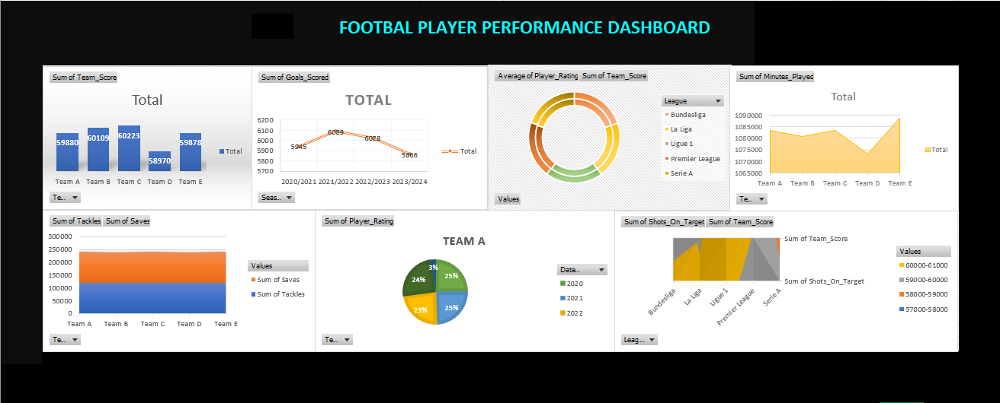

# Football Match & Player Performance Analysis

This project analyzes 120,000+ football match records to uncover player and team performance trends using **Microsoft Excel**. The dataset includes player statistics, match outcomes, and team comparisons across major leagues.

   ---
   
## Dashboard Preview
  

## Project Highlights

- Analyzed a dataset of **120,000+ rows** covering player performance, match outcomes, goals, assists, tackles, ratings, and more.
- Built **pivot tables** to summarize player stats, team performance, and disciplinary records.
- Created an **interactive Excel dashboard** with slicers and dynamic charts to visualize:
  - Top goal scorers
  - Match win/loss trends
  - Player rating trends
  - Position-wise performance comparison
  - Season, League and team analysis

## Tools Used

- **Microsoft Excel**
  - Pivot Tables
  - Pivot Charts
  - Slicers & Filters
  - Conditional Formatting
  - Data Visualization (bar, line, pie, radar charts)

## Key Insights

- Identified top-performing players and teams based on goals, assists, and ratings.
- Compared performance across player positions using radar charts.
- Analyzed trends in match outcomes and disciplinary actions.
- Enabled interactive filtering by team, season, league, and position.

## Project Goals

- Practice Excel skills on a large sports dataset
- Build an interactive and insight-rich dashboard
- Translate raw data into meaningful visuals for decision-making

# Contact
**Mathiyarasi S** – Aspiring Data Analyst  
📩 mathisoundar2004@gmail.com  
🔗 [LinkedIn Profile](https://www.linkedin.com/in/mathiyarasi85/)

---

